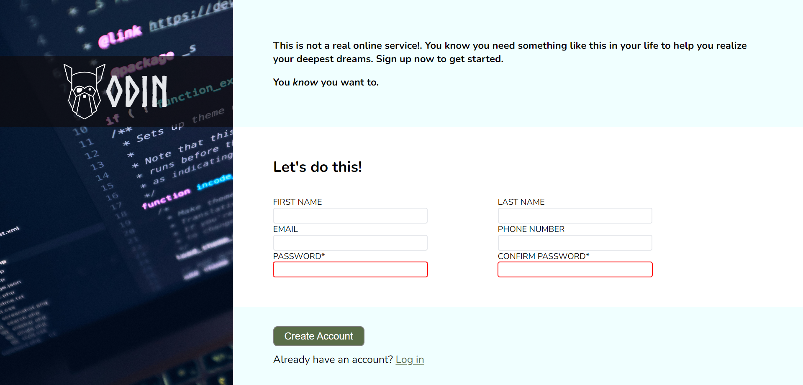

# Sign-up Form

A simple, responsive sign-up form created using **HTML** and **CSS**. This project showcases a clean UI design for collecting user information, focusing on aesthetics, usability, and accessibility. 

## ✨ Features

- **Simple Design:** Minimal and elegant form layout.
- **Form Validation:** Input fields include basic validation rules to ensure required information is collected.
- **Responsive UI:** Looks good on both desktop and smaller screens.
- **Custom Styling:** No external CSS frameworks used to maintain full control over design.
  
## 📂 Project Structure

```
/sign-up-form
│
├── index.html    # Main HTML file
├── style.css     # CSS file for styling the form
└── README.md     # Project documentation
```

## 🔧 Tech Stack

- **HTML5**: Markup language for structuring the form.
- **CSS3**: Custom styling for layout and responsiveness.

## 🚀 Live Demo

[View the Live Demo](https://axyl07.github.io/sign-up-form/)  

## 📸 Screenshots

  
*Example screenshot of the sign-up form (replace with actual image URL).*

## 📝 Usage

1. Clone the repository:  
   ```bash
   git clone https://github.com/Axyl07/sign-up-form.git
   ```
2. Open the `index.html` file in your browser to view the form.

## 🎯 Future Improvements

- Add **JavaScript validation** for better user experience.
- Improve **mobile responsiveness** with media queries.
- Integrate with a **backend service** to store user data.

## 🤝 Contributing

Contributions are welcome! Feel free to fork the project, submit issues, or make a pull request.  

